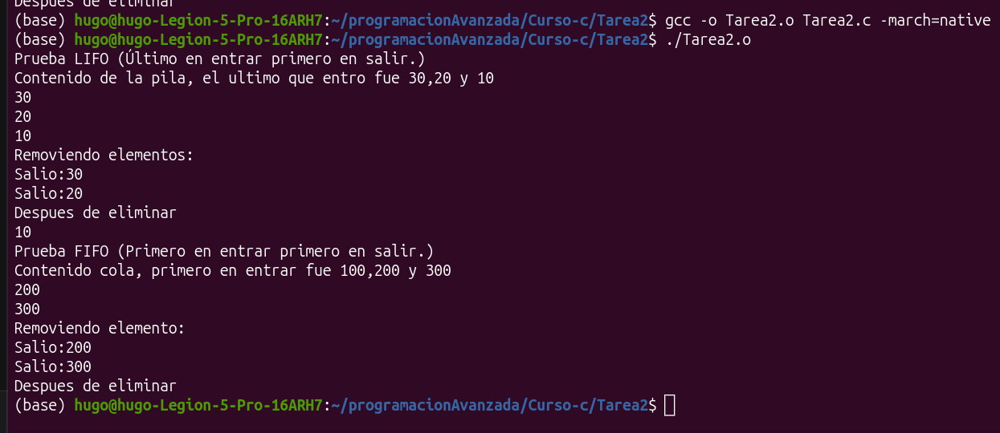

# Tarea 2 
# Implementar en c con listas ligadas la estructura LIFO Y FIFO.

<!--
Source - https://stackoverflow.com/a/38274615
Posted by user3638471, modified by community. See post 'Timeline' for change history
Retrieved 2026-09-22, License - CC BY-SA 4.0
-->

