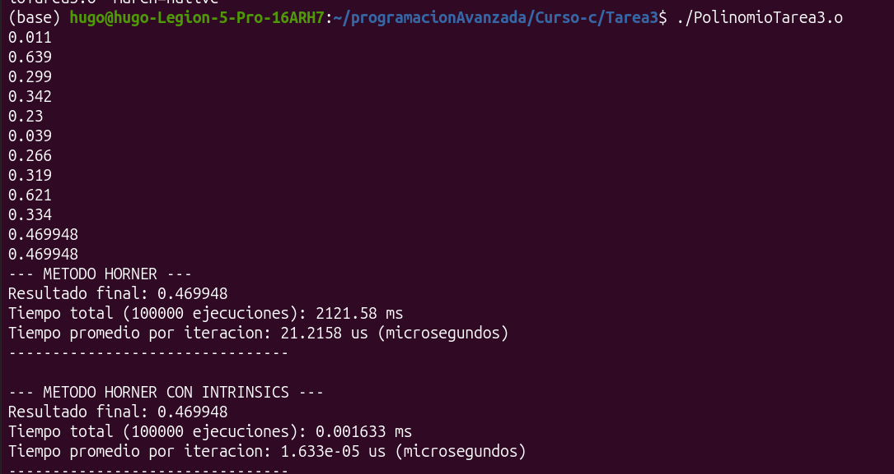

# Tarea 3

## Método de horner

## Método de horner utilizando el método tradicional

## Método de horner utilizando funciones y tipos de datos  intrinsec

Utilizando tipo de datos:

Double
 __m256d

4 valores de 64 bits

Se utilizan las funciones 
* _mm256_mul_pd
* _mm256_add_pd

Float
 __m256

8 valores de 64 bits

Se utilizan las funciones 
* _mm256_mul_ps
* _mm256_add_ps

Marcas de tiempo en c++

Biblioteca

chrono

Proporciona el intervalo de tiempo más corto disponible para mediciones de alta precisión.

* chrono::high_resolution_clock

Reloj monotónico que nunca se ajustará

* chrono::steady_clock

Tiempo del reloj de pared desde el reloj en tiempo real de todo el sistema

* chrono::system_clock

Ejecutando archivo PolinomioTarea3.cpp

