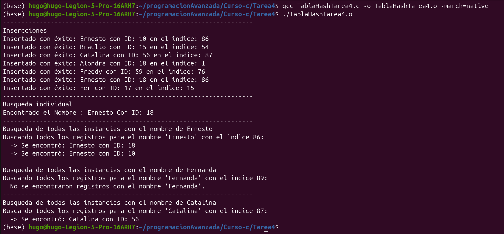

# Tarea 4 Tabla de hash 

Modificando código visto en clase para evitar colisiones.

Podemos ingresar un nombre con un id,  ahora, si se ingresa otro elemento con el mismo nombre pero con un id diferente se puede ingresar, porque puede haber dos registros con el mismo nombre pero con id´s diferentes, si se ingresa dos nombres iguales y id´s iguales no se podrá realizar el ingreso de estos nombres y sus id´s.

Funciones hash funcion_hash y funcionHashDJB2 esta última se ingreso para realizar pruebas.
El código actual funciona con funcion_hash.

Capturas de la compilacion y ejecucion del codigo.
TablaHashTarea4.c

## Hugo Miranda Cano