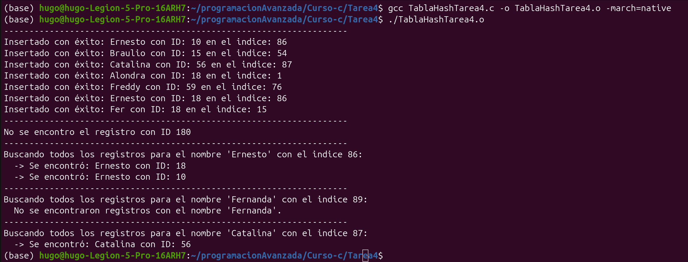

# Tarea 4 Tabla de hash 

Modificando código visto en clase para evitar colisiones.

Se ingresó otra funcion hash llamada Hash DJB2

Capturas de la compilacion y ejecucion del codigo.
TablaHashTarea4.c

## Hugo Miranda Cano